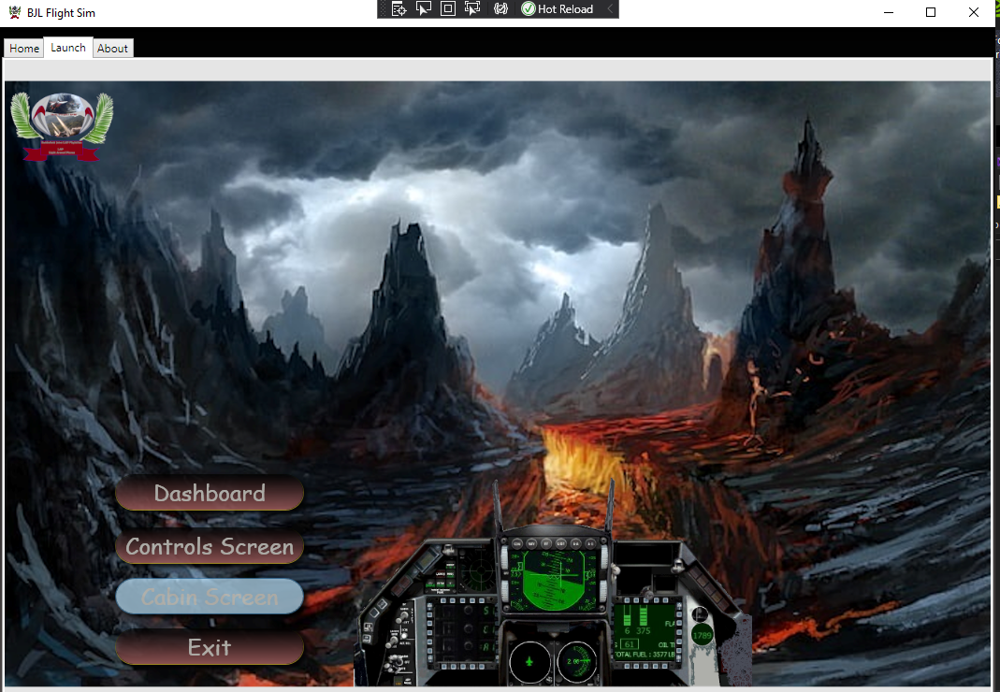
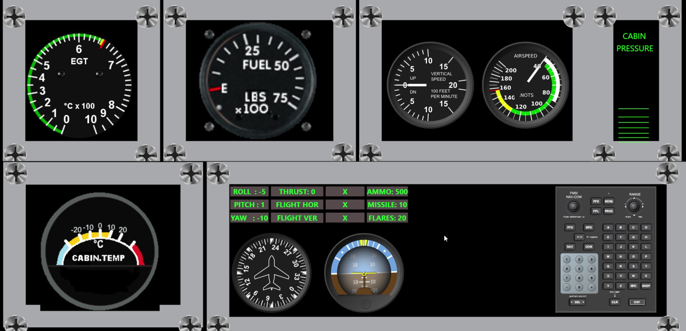

# flight_sim_shebang
WPF Flight Simulator with Drone integration.
The flight simulator also guides the drone and all movent of the drone is felt in the simulator's cockpit as if the pilot|gamer is inside the drone.


### Main window:



### Cabin:



### Controls:
```shell
...
...
...

```


## Authors
- [Billy Louis](): C++, WPF & Golang code integration.


## Badges
Hardware Team: [EULA.com](https://www.icertis.com/contracting-basics/the-importance-of-the-end-user-license-agreement/)

[](https://choosealicense.com/licenses/eula/)
